# Supervisor Node Replacement in Red Hat OpenShift Container Platform 4

## Introduction

This blog captures details to evaluate replacing a supervisor (control plane) node in Red Hat OpenShift 4 in on premises environments.  It illustrates a use case of migrating from a virtual machine based supervisor node (hosted on a single Red Hat Enterprise Linux KVM hypervisor system) to a physical bare-metal system. 

This will be achieved by deploying a VM-based three-node Compact Cluster, which are cluster nodes that host both control plane functions and user facing workloads. Once the cluster is up, workloads will be created on top of the cluster to demonstrate that workloads remain up and running, even during Supervisor node replacement, one at a time.During this procedure, the Ignition file from the supervisor nodes will be extracted from the running cluster and stored on an accessible HTTP server to be consumed by new baremetal nodes. These bare metal nodes will boot using the RHCOS ISO, and with a few commands, the new baremetal node will be added to the cluster. This document will also cover how to successfully decommission the virtual-machine based nodes that are being relieved from their supervisor duties, how to ensure they no longer have ETCD membership and remove any secrets associated with them. Finally, we will cover steps to perform a minor OpenShift cluster upgrade and all validation steps to ensure a successful replacement.

**Disclaimer**: Please note that this is a commercially UNSUPPORTED (by Red Hat) procedure as of this writing (August 2022). Red Hat would like for mutual customers to work with our Global Support team for any problems that arise with corrupted master nodes, which require reprovisioning.  This is obviously a sensitive procedure that requires care, and is not one that we would like for customers to go through without Support engaged.


## OpenShift Container Platform Installation with Crucible

Crucible Automation is a set of playbooks for installing an OpenShift cluster on-premise using the developer preview version of the OpenShift Assisted Installer. Using Crucible, one can install and set up multiple OpenShift 4 clusters in a simplified and automated way.

For our particular deployment, we need to ensure complete segregation of networks and using Crucible all the prerequisites for both OpenShift Clusters (DNS/DHCP/Bridging/VLANS) are set up with ease.

Clone Crucible repository using the commands below:

```
$ git clone https://github.com/redhat-partner-solutions/crucible
```

In order to use these playbooks to deploy OpenShift, the availability of a jump/bastion host (which can be virtual or physical) and a minimum of three target systems for the resulting cluster is required. These playbooks are intended to be run from the jump/bastion host that itself is subscribed to Red Hat Subscription Manager.

For this lab based deployment guide, we will try to create 1 cluster in total. Running the playbooks will deploy and set up a fully operational OpenShift 4.9 cluster with control plane nodes deployed as virtual machines on top of one bare-metal server.

Each virtual machine for control plane nodes of OpenShift cluster should have the following minimum specifications:

**vCPU**: 6

**Memory**: 24GB

**Disk**: 120gb

Below is the reference crucible inventory files for our cluster:


When inventory files for our cluster is ready, we can start the crucible deployment with following:
```
ansible-playbook -i 2361inventory.yml site.yml -vv
```
When deployment finishes, we can see the GUI address, password, kubeconfig file in our assisted installer GUI. It is possible to reach Assisted Installer GUI from **http://<bastion_IP>:8080/clusters**

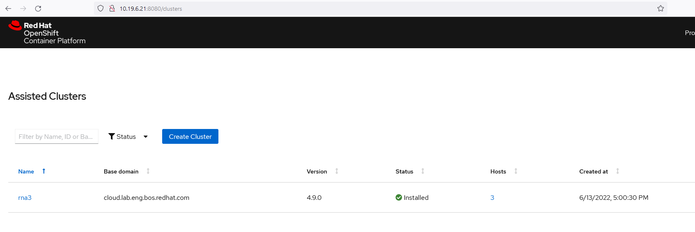

If you click on the cluster, you can see the details about that cluster.

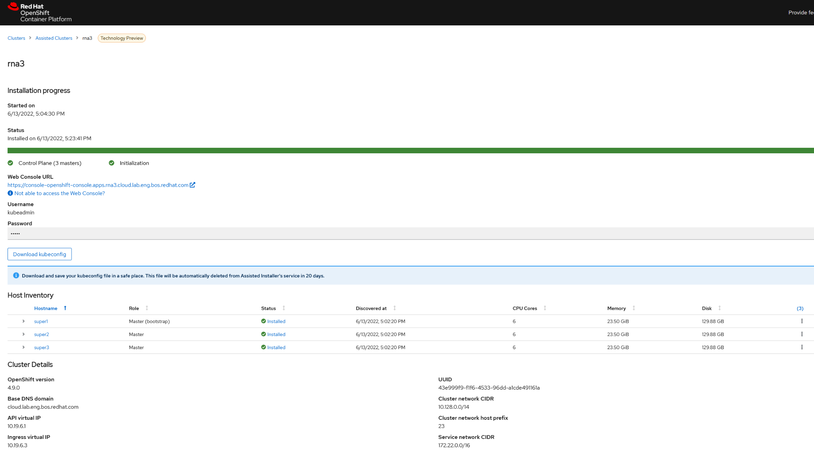

After the deployment is completed, architecture of our system is like the following:
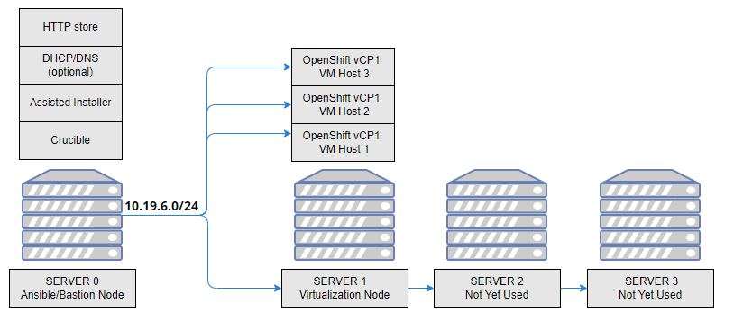

After replacement of the virtual supervisor nodes  are completed, the overall system architecture will be like following at the end:
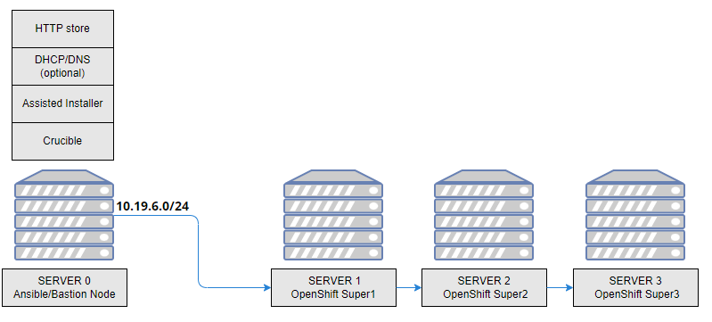

## Cluster Customization
Now that we have an OpenShift cluster up, we need a few other pieces of system infrastructure to simulate workloads running on it during the replacement procedure.

### NFS Server installation on bastion host

We will first create an NFS server instance on our bastion host and create some workload on OCP using these NFS provided storage volumes, really to simulate persistent workloads that have data backing them. So this step will be the installation of the NFS server packages on the RHEL/CentOS 8 system.

```
sudo yum -y install nfs-utils
```
Now create the directory that will be shared by NFS:
```
mkdir /var/nfsshare
```
Change the permissions of the folder as follows:
```
chmod -R 755 /var/nfsshare
chown nfsnobody:nfsnobody /var/nfsshare
```
After the installation, start and enable nfs-server service:
sudo systemctl enable --now nfs-server rpcbind

Next, we need to start the services and enable them to be started at boot time. 
```
systemctl enable rpcbind
systemctl enable nfs-server
systemctl enable nfs-lock
systemctl enable nfs-idmap
systemctl start rpcbind
systemctl start nfs-server
systemctl start nfs-lock
systemctl start nfs-idmap
```
Now we will share the NFS directory over the network a follows:
```
vi /etc/exports
/var/nfsshare   10.19.6.18(rw,sync,no_root_squash,no_all_squash)
/var/nfsshare    10.19.6.6(rw,sync,no_root_squash,no_all_squash)
/var/nfsshare    10.19.6.7(rw,sync,no_root_squash,no_all_squash)
/var/nfsshare    10.19.6.8(rw,sync,no_root_squash,no_all_squash)
```
Finally, start the NFS service:
```
systemctl restart nfs-server
```
Again we need to add the NFS service override in CentOS 8 firewall-cmd public zone service as:
```
firewall-cmd --permanent --zone=public --add-service=nfs
firewall-cmd --permanent --zone=public --add-service=mountd
firewall-cmd --permanent --zone=public --add-service=rpc-bind
firewall-cmd --reload
```

## Workload deployment on OpenShift cluster

In order to verify and check the functionality of the OCP cluster before and after the supervisor node replacement, we will create some workload on our cluster so we will deploy some deployments, persistent volumes and persistent volume claims on our OCP cluster using the NFS volumes that we deployed on the previous steps.
The following are the yaml files for our deployments, persistent volumes and persistent volume claims:

Persistent Volume:
```                  
oc create -f - <<EOF
apiVersion: v1
kind: PersistentVolume
metadata:
  name: pv0001 
spec:
  capacity:
    storage: 5Gi 
  accessModes:
  - ReadWriteOnce 
  nfs: 
    path: /var/nfsshare
    server: 10.19.6.21
  persistentVolumeReclaimPolicy: Retain 
EOF
```
Persistent Volume Claim:
```
oc create -f - <<EOF
apiVersion: v1
kind: PersistentVolumeClaim
metadata:
  name: nfs-claim1
spec:
  accessModes:
    - ReadWriteOnce 
  resources:
    requests:
      storage: 5Gi 
  volumeName: pv0001
  storageClassName: ""
EOF
```

Deployment:
```
oc create -f - <<EOF
apiVersion: apps/v1
kind: Deployment
metadata:
  name: hello-openshift
spec:
  replicas: 1
  selector:
    matchLabels:
      app: hello-openshift
  template:
    metadata:
      labels:
        app: hello-openshift
    spec:
      containers:
      - name: ceph-busybox
        image: quay.io/openshifttest/busybox
        command: ["sleep", "60000"]
        volumeMounts:
        - name: ceph-vol-test
          mountPath: /usr/share/busybox
          readOnly: false
      volumes:
      - name: ceph-vol-test
        persistentVolumeClaim:
          claimName: nfs-claim1
EOF
```
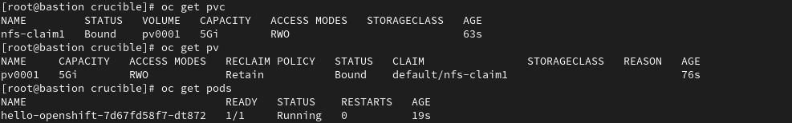

## Supervisor Replacement Procedure

Now that we have the OpenShift cluster deployed with running workloads, we are ready to begin the process of migrating to physical supervisor machines.  The following steps detail how to replace the VM supervisor machines one at a time.

### Step1: Extract the ignition for the control plane from the cluster
Ignition is a low-level system configuration utility that is used by RHCOS to manipulate disks during initial configuration.  It completes common disk tasks, including partitioning disks, formatting partitions, writing files, and configuring users.

We need to extract the ignition for the currently running control plane servers (supervisor systems) to build our baremetal replacements.

Red Hat’s Knowledge Base Articles show how to do this in general, and is available here:
https://access.redhat.com/solutions/5504291

Using the following in our environment:
```
oc extract -n openshift-machine-api secret/master-user-data --keys=userData --to= {/PATH}
```

We will extract the ignition file for the current state of the cluster, and save the ignition file to any HTTP server accessible location.  This will need to be accessible by the running OpenShift cluster.

Once the ignition configuration has been extracted it should look similar to this example:
```
{"ignition":{"config":{"merge":[{"source":"https://10.19.6.1:22623/config/master"}]},"security":{"tls":{"certificateAuthorities":[{"source":"data:text/plain;charset=utf-8;base64,LS0tLS1CRUdJTiBDRVJUSUZJQ0FURS0tLS0tCk1JSURFRENDQWZpZ0F3SUJBZ0lJYnpFMDJ0U0lNQW93RFFZSktvWklodmNOQVFFTEJRQXdKakVTTUJBR0ExVUUKQ3hNSmIzQmxibk5vYVdaME1SQXdEZ1lEVlFRREV3ZHliMjkwTFdOaE1CNFhEVEl5TURZeE16RTBNRFF6T0ZvWApEVE15TURZeE1ERTBNRFF6T0Zvd0pqRVNNQkFHQTFVRUN4TUpiM0JsYm5Ob2FXWjBNUkF3RGdZRFZRUURFd2R5CmIyOTBMV05oTUlJQklqQU5CZ2txaGtpRzl3MEJBUUVGQUFPQ0FROEFNSUlCQ2dLQ0FRRUF0N2F4WWg3L3NsamMKcm1RME1qOG9JVUtFdkx4NEl0MTRkcjBjMyt5aW9nOStJZFhDM1hpWmhHcGpNQ1Yxa1FvSmR5VVoyZWo2bCtjVQpHQXZnOURTdHE2OW04OEdvZlErMHJ6UUlRMmROS1krUDJJejRPaTNITFF2MEQzUXV4dlZRbjJSY2UrcU82ZHNGClB6eDdCV0JraVBPSHdLN2NSMVd0azFlb0tmZGVJUjhYU3VyT1pmS2w4RUV1a1BMVC8wekg0WmwrVi9GQ0ZIVHAKaTBBdTdWdzMyRWVpMkFjOHFXUmE0QVNkSmtBeFBUS1FNN0VvZmlZWkU4L1o2NUU5UHRkVFVldXNzWExUWmRTYQoxbkhEalJ5SkdPNnloaUxrc2RUdmZWd0dyYlJqOFV6VG9pQ3U5cEpETlR5bldDei9jS3NEOUtrVHBZYk11UUR1CmhkWWpuaEVDN1FJREFRQUJvMEl3UURBT0JnTlZIUThCQWY4RUJBTUNBcVF3RHdZRFZSMFRBUUgvQkFVd0F3RUIKL3pBZEJnTlZIUTRFRmdRVVRuQ1V5cERKRjlaanBBL3VjeFhBREVwamxNNHdEUVlKS29aSWh2Y05BUUVMQlFBRApnZ0VCQUZaaThDaFpuWWt6czlsaXJRVDBheWdTMm9kSTRQRzFCZC9jT0MwbmNSYlQxb01vMUw4MWlsZ3prRXlNClJMcXJkbzY4OXU3aWpUYXQxcjNkdExQdnZjWS9JeGZUT0JPU0kwdDV3aXBZWWUyRnpVVDF5NDU0RnM0cXhvbGMKRURBMDFoRERiR20vanlIdmoxa2xOci9pNUdQd1p3RjdvbnhVUXRhaFVMNjkvaU5ZR3Ivazl6cFBxcXNuV1dLegpsdVp5dFhkdUNjM1RHRXdSSVNNaElGTjJNOFVuNlRlUFFTN0Z3OHJXZERtbFlyV0h2azFSK25vVUQvbTJNQ3BTCjZBejZvZHVCdW9tMi9sMTBUSkZXS2RKOFlGK1J5STlGVDc0SFhBREljbTc1UFdEOTlCK21HdGZHMkQxNE84bjcKTklQNkdqT3hxOERTYnB6UTVvUEs1T0FKSDFJPQotLS0tLUVORCBDRVJUSUZJQ0FURS0tLS0tCg=="}]}}
```

The file will be saved as a userData file. Save this as a .ign file and store it on the http server.

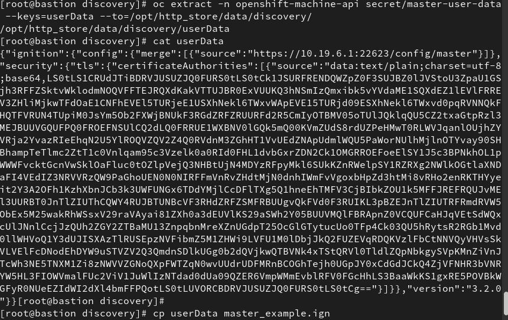

While we were using Crucible automation, HTTP store is already deployed on bastion host and our directory for placing the file is **/opt/http_store/data/discovery/** so the ignition file can be stored under this directory.

### Step 2: Gracefully shutdown and remove existing Supervisor node
We will be required to remove one of the existing Supervisor node from our OpenShift cluster.  For us, we first chose the node named super1.
Mark the nodes unschedulable before performing the pod evacuation.
```
oc adm cordon <node–name>
```
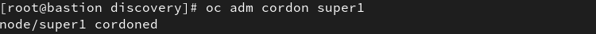

Check that the node status is NotReady,SchedulingDisabled:
```
oc get node <node–name>
```
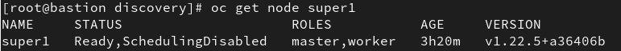
Evacuate all or selected pods on the node.Force the deletion of bare pods using the --force option. When set to true, deletion continues even if there are pods not managed by a replication controller, replica set, job, daemon set, or stateful set. Ignore pods managed by daemon sets using the --ignore-daemonsets flag set to true.
```
oc adm drain <node-name> --force=true --ignore-daemonsets=true --delete-local-data=true  --disable-eviction
```
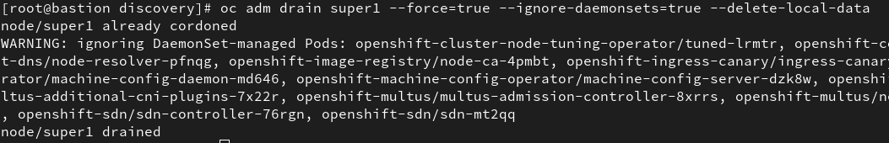
Delete the node from the cluster: 
```
oc delete node <node-name>
```
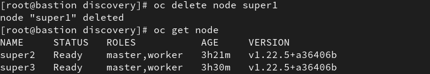

Lastly, ensure that the replaced VM system is gracefully shutdown.

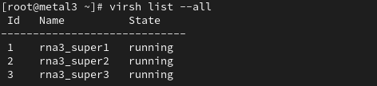
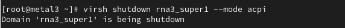
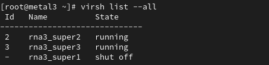
After deleting the node, wait sometime and then we will also have to remove its ETCD membership. 

### Step 3: Remove etcd membership
To ensure our migration is successful, and to keep our cluster with the supported number of supervisor machines (3),  we must remove the deleted VM-based supervisor systems from the etcd database in the OpenShift Cluster, one at a time.

Check the status of the EtcdMembers Available status condition using the following command:
```
oc get etcd -o=jsonpath='{range .items[0].status.conditions[?(@.type=="EtcdMembersAvailable")]}{.message}{"\n"}'
```

#### Removing the member:
In a terminal that has access to the cluster as a cluster-admin user, run the following command:
```
oc get pods -n openshift-etcd | grep -v etcd-quorum-guard | grep etcd
```
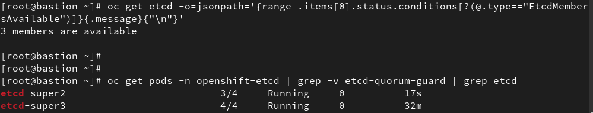

Connect to the running etcd container, passing in the name of a pod that is not on the removing node.  In our example, we have removed super1 already, so we need to connect to either super2 or super3.

In a terminal that has access to the cluster as a cluster-admin user, run the following command to connect to the etcd pod running on the super2 system:
```
oc rsh -n openshift-etcd etcd-super2
```


View the member list:
```
etcdctl member list -w table
```


Remove the deleted etcd member by providing the ID to the etcdctl member remove command:
```
etcdctl member remove <ID>
```


Note: This command might give etcdserver: unhealthy error. Allow sometime and try again.
```
etcdctl member list -w table
```
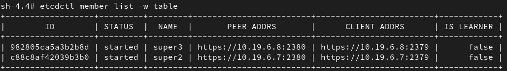

Remove the old secrets for the deleted etcd member that was removed:
List the secrets for the etcd member that was removed.
```
etcdctl member list -w table
```


Delete the secrets for the etcd member that was removed:
Delete the peer secret:
```
oc delete secret -n openshift-etcd etcd-peer-super1
```
Delete the serving secret:
```
oc delete secret -n openshift-etcd etcd-serving-super1
```
Delete the metrics secret:
```
oc delete secret -n openshift-etcd etcd-serving-metrics-super1
```


In a terminal that has access to the cluster as a cluster-admin user, run the following command:
```
oc get bmh -n openshift-machine-api -o wide
```
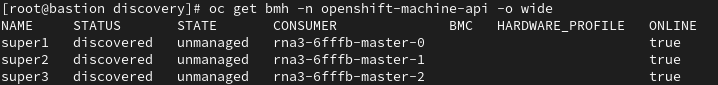

Capture the master BMH CR to file, we will use this file later in later stages(STEP 6).
```
oc get bmh super1 -n openshift-machine-api -o yaml > bmh.yaml
```
In a terminal that has access to the cluster as a cluster-admin user, run the following command:
```
oc get machines -n openshift-machine-api -o wide
```
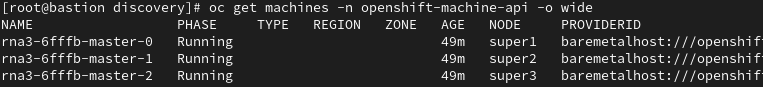

Capture master Machine CR to file, we will use this file later in later stages(STEP 6).
```
oc get machine rna3-6fffb-master-0 -n openshift-machine-api -o yaml > machine.yaml
```

Delete the BMH CR of the member to be removed, which corresponds with the super1 system:
```
oc delete bmh -n openshift-machine-api super1
```
Delete the Machine CR of the member to be removed, which corresponds with the super1 system:
```
oc delete machine -n openshift-machine-api rna3-mk8v5-master-0
```
Verify that the bmh was deleted:
```
oc get bmh -n openshift-machine-api -o wide
```
Verify that the machine was deleted:
```
oc get machines -n openshift-machine-api -o wide
```
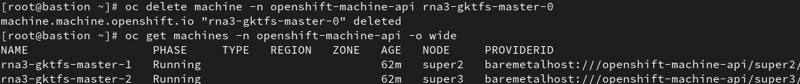

After performing all the steps above check on the cluster operators, if any particular errors occur they will be captured using the following command:
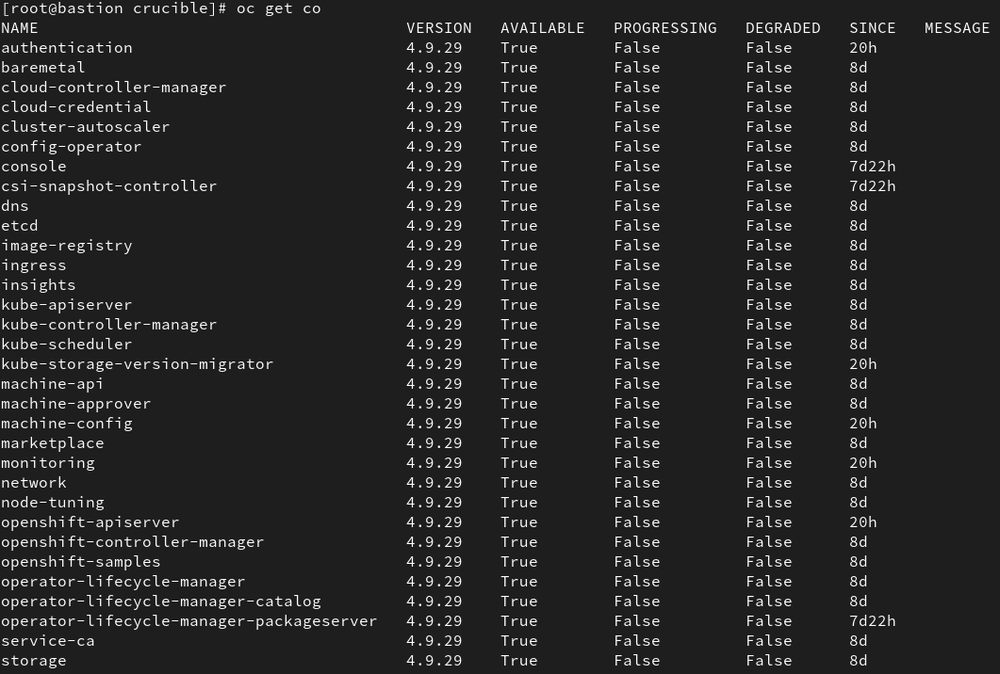

### Step 4: Booting supervisor RHCOS bare metal machines using an ISO image stored in HTTP Store
You can create a replacement Red Hat Enterprise Linux CoreOS (RHCOS) supervisor machine for your cluster by using an ISO image to create the machines.

**Please note that Red Hat supports exactly three control plane nodes as documented here.**

The following link provides the basic RHCOS ISO image:
https://mirror.openshift.com/pub/openshift-v4/dependencies/rhcos/4.9/

After downloading the RHCOS ISO image from that link, we again need to place this image in the HTTP store (/opt/http_store/data/discovery/ directory) so that we can later boot our server this image from the BMC (iDRAC, iLO, etc) of the servers.

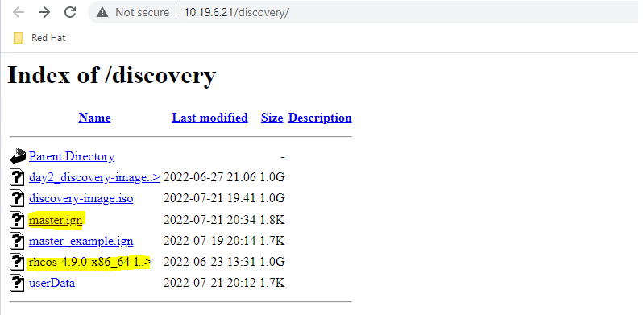

1. Boot the node with RHCOS ISO, or by using the boot ISO playbooks in Crucible. In our case, we booted the ISO from iDRAC management system of our node:


Once you have boot the ISO on your BM machine and start the server, you will be prompted to an installer screen shown below:
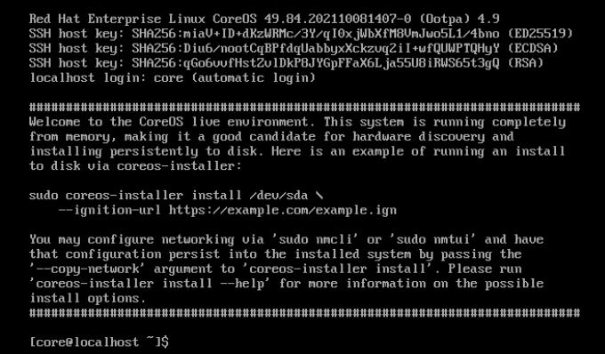

2. In order to ensure the network configuration is set correctly we need to statically assign the IP address, gateway and DNS on the baremetal supervisor node. Use nmcli commands mentioned below as an example:
```
nmcli connection show 
sudo nmcli con mod "Wired connection X" ipv4.addresses "X.X.X.X/X"
sudo nmcli con mod "Wired connection X" ipv4.method manual
nmcli con mod Wired\ connection\ X ipv4.gateway X.X.X.X
nmcli con mod Wired\ connection\ X ipv4.dns X.X.X.X
sudo nmcli con up "Wired connection X"
```
3. In order to configure persistent hostname when creating RHCOS in OpenShift 4.6 or later, Hostname can not persist while passing the **--copy-network** option to the coreos-installer command when creating RHCOS.

The recommended way to configure the hostname would be to provide a unique Ignition config that writes out **/etc/hostname** with the desired value for the system during install time.

```
{"ignition":{"config":{"merge":[{"source":"https://10.19.6.1:22623/config/master"}]},"security":{"tls":{"certificateAuthorities":[{"source":"data:text/plain;charset=utf-8;base64,LS0tLS1CRUdJTiBDRVJUSUZJQ0FURS0tLS0tCk1JSUR…"}]}},"version":"3.2.0"},"storage":{"files":[{"path":"/etc/hostname","contents":{"source":"data:,metal3"},"mode":420}]}}
```
Ensure that "data:,metal3" matches your baremetal node name.

In the example, a storage section has been added to the Ignition config. This section instructs Ignition to write out **/etc/hostname** with the contents worker0.example.com.

It is necessary to create modified Ignition configurations for each node of which the hostname needs to be configured and then make them available via HTTP or HTTPS.

4. After that save the master.ign file to an HTTP server accessible location. Your master.ign file should now  look similar to this with the storage section added:
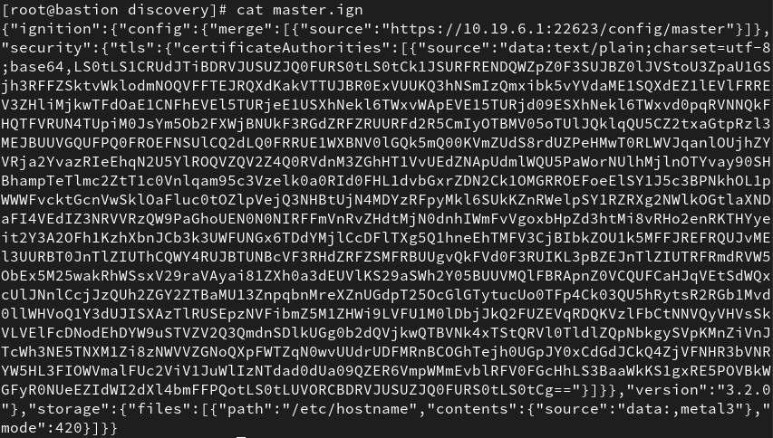

5. In the CLI of the booted node, issue **coreos-installer install --ignition-url <ignition>** to pull the master.ign file from a HTTP server and install Red Hat Enterprise Linux CoreOS on disk device **/dev/sda**:

```
sudo coreos-installer install /dev/sdc --ignition-url http://10.19.6.21/discovery/master.ign --insecure-ignition --copy-network
```
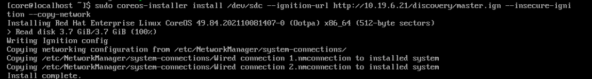
  
Once installation on the disk is completed, reboot the node.

### Step 5: Approving the certificate signing requests for your new machine
  
When you add the new bare metal machine to the cluster, two pending certificate signing requests (CSRs) are generated. You must confirm that these CSRs are approved, or if necessary, approve them yourself. The client requests must be approved first, followed by the server requests.

#### Procedure:

Review the pending CSRs and ensure that you see the client requests with the Pending or Approved status for each machine that you added to the cluster:

```
$ oc get csr
```


If the CSRs were not approved, after all of the pending CSRs for the machines you added are in Pending status, approve the CSRs for your cluster machines:
To approve them individually, run the following command for each valid CSR:

To approve them individually, run the following command for each valid CSR:
```
$ oc adm certificate approve <csr_name>
```
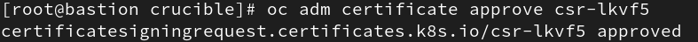

Alternatively, to approve all pending CSRs, run the following command:
```
$ oc get csr -o go-template='{{range .items}}{{if not .status}}{{.metadata.name}}{{"\n"}}{{end}}{{end}}' | xargs --no-run-if-empty oc adm certificate approve
```
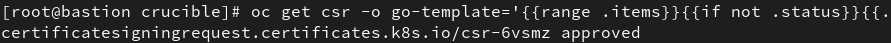

Now that your client requests are approved, you must review the server requests for each machine that you added to the cluster:
```
$ oc get csr 
```


Confirm that the cluster recognizes the machines: 
```
$ oc get nodes 
```


Once the new supervisor node is added please allow some time for the cluster to reach a healthy state. Keep a check on the cluster operators, if any particular errors occur they will be captured using the following command:


Validate that the workloads you put into place earlier are also running smoothly after adding new supervisor nodes and deleting the replaced supervisor nodes.
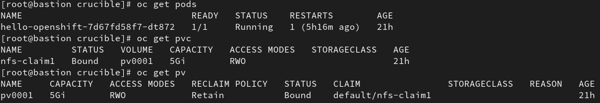

### Step 6: Create new BMH and Machine CR
To re-create objects that were originally created for the virtual machine based supervisor systems, we have to create them manually for the new bare metal system.  These Custom Resource Definitions include BareMetalHost and Machine CRs, respectively.

 **Create new BMH (based on original BMH)**
Open the file saved earlier using a text editor and delete all parameters inside the file except the following below in the screenshot:
Name & MAC address should be changed to match replaced BM node MAC address.
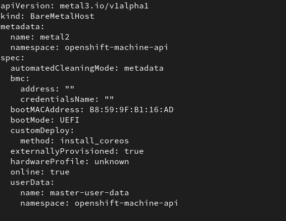

Once these changes have been made, re-apply the BMH file:
```
$ oc apply -f bmh.yaml
```
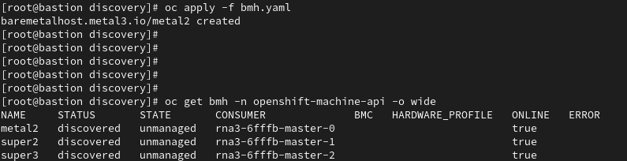

**Create new Machine (Based on original Machine)**
Open the file saved earlier using a text editor and delete all parameters inside the file except the following below in the screenshot:
Keep the base of the metadata->name, just change the last number to something new.
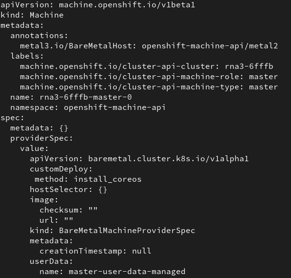

Once these changes have been made, re-apply the machine file:
```
$ oc apply -f machine.yaml
```
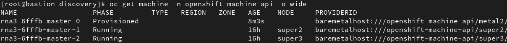
  
After all the process is completed, we can verify if etcd has fully recovered and control plane functionality is “normalized”. In order to do this, we can first check if all the etcd pods are running fine:

```
$ oc get pods -n openshift-etcd | grep -v etcd-quorum-guard | grep etcd
```
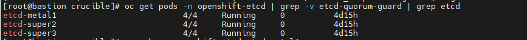

Then, we should verify that etcd has exactly 3 member so we first need to connect to one of the etcd pods:
```
$ oc rsh -n openshift-etcd etcd-metal1
```
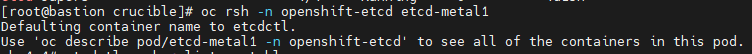
  
Use the following command to view the etcd member list:
```
$ etcdctl member list -w table
```
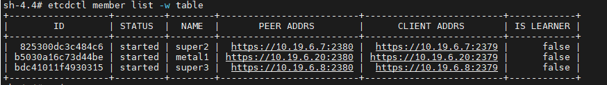  

Here, we can verify that our new baremetal node is registered as a member of etcd and we have a total of 3 etcd members right now. 
 
Another thing we can verify is that etcd endpoint health when connected to one of the etcd pods:
```
$ etcdctl endpoint health
```
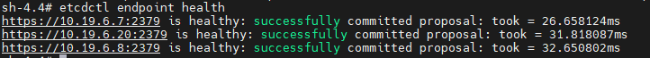

### Step 7: Replacing 2nd supervisor
Repeat steps 2 through 6 to replace the second supervisor node.
  
### Step 8: Replacing 3rd supervisor
Repeat steps 2 through 6 to replace the third supervisor node.

Once all supervisor nodes have been replaced, we can verify that all supervisor nodes are in healthy condition:
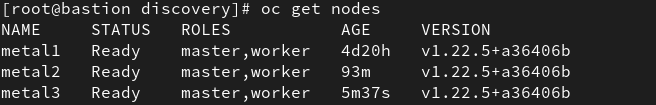
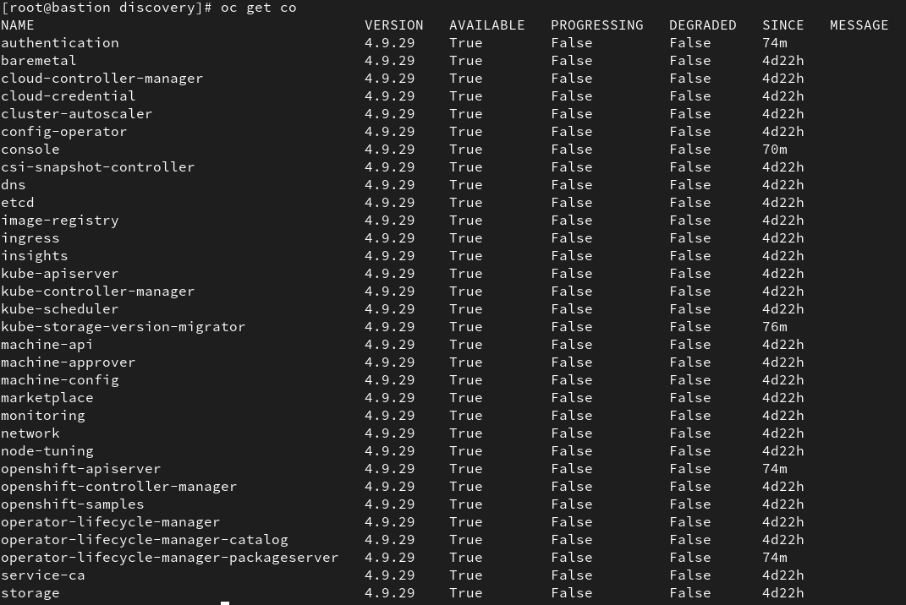
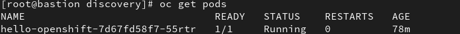
  
## Minor Cluster Upgrade

As a successful migration from virtual machine based supervisor nodes, take the OpenShift cluster through a minor upgrade to ensure proper administrative operations. 
This can be easily achieved using the OpenShift Web GUI.

  From the OpenShift Web console proceed to click “Upgrade Cluster” or navigate to **Cluster Settings > Details > Click “Update”** to upgrade.

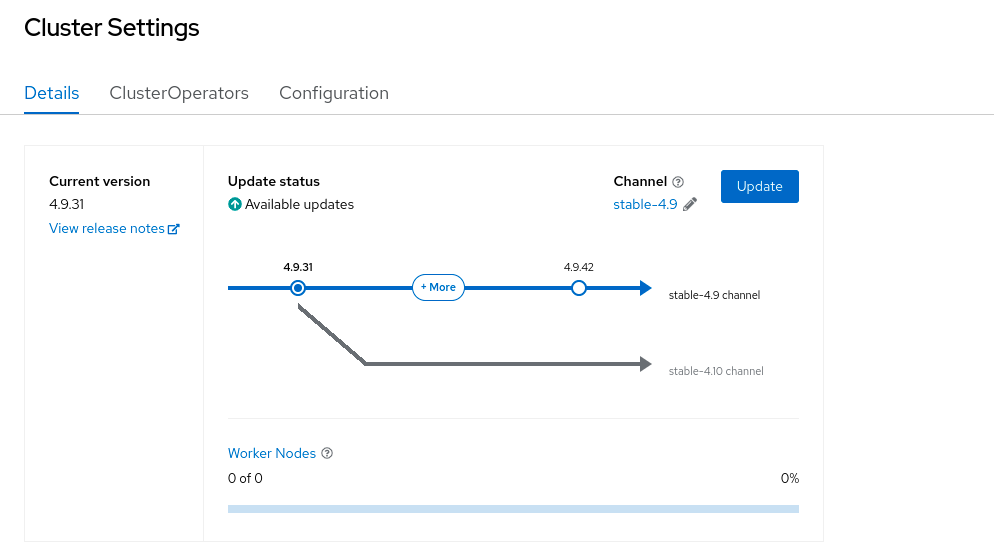

From the drop down menu of possible releases select and Click **“Update”**:

  
The machine config operators will do a rolling upgrade of the platform and this will upgrade all the OpenShift cluster operators and the operating system of the identified node roles (e.g master & workers) to the desired version.

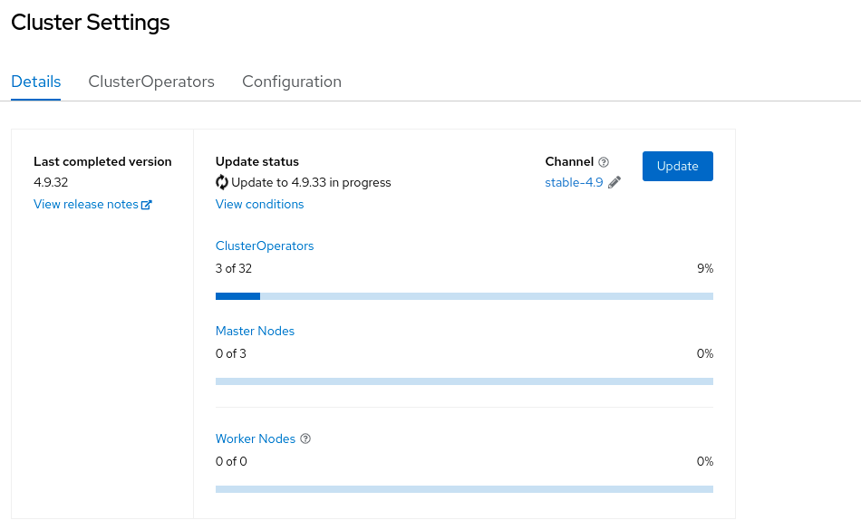

Please allow approximately 1 hour for the upgrade to complete. Once the upgrade is completed, you can verify all cluster operators are back in healthy state.


Also validate that the workloads you put into place earlier are also running smoothly after the upgrade, and get deployed on the new supervisor nodes.
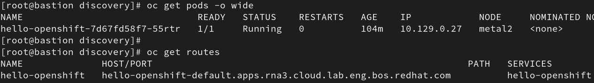
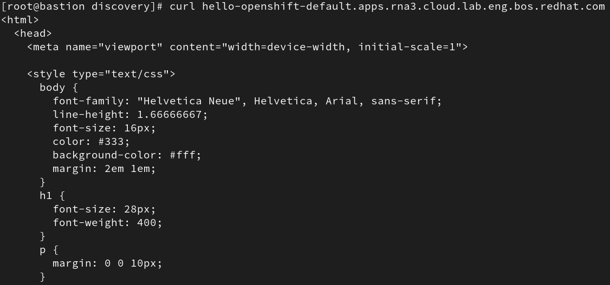
  
## Conclusion

This blog illustrates necessary steps required to successfully replace a supervisor node in Red Hat OpenShift 4, including correct steps to decommission the VM based supervisor nodes.  It also showcases that minor upgrades on our new supervisor nodes are functioning successfully.
The document also highlights specifically a use case of migrating from a virtual machine based supervisor node (hosted on a single Red Hat Enterprise Linux KVM hypervisor system) to a physical bare-metal system.

The validation steps covered in this document show that the control plane traffic as well as all running workloads were not interrupted and remained up and accessible.


