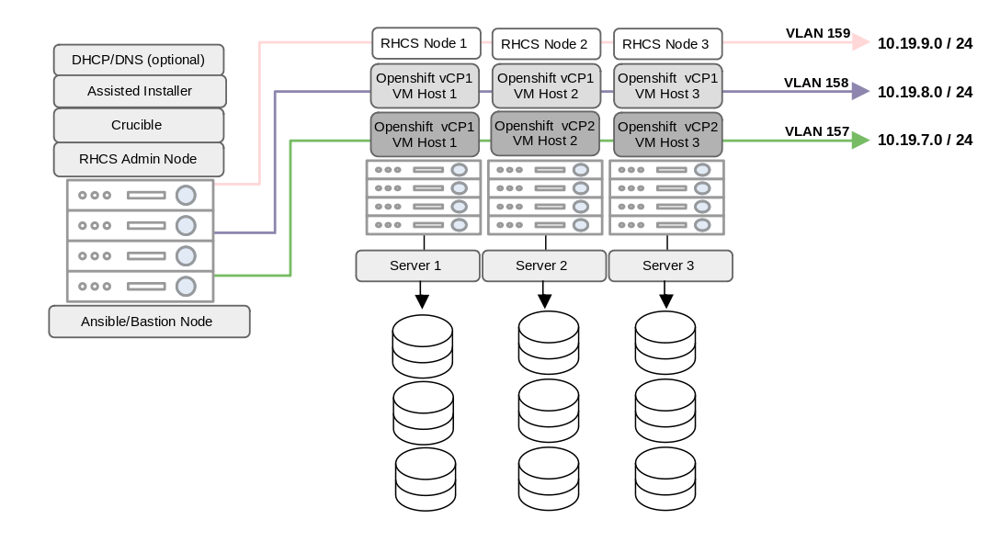

# Deploying RHCS using minimum hardware resources and efficiently making it work for multiple clusters via ODF

Having a software defined storage fabric such as Red Hat Ceph Storage (RHCS) is advantageous to provide file, block and object storage services for workloads deployed on top of Openshift. In many cases Openshift clusters are required to have a storage solution in place that is highly available for multiple clusters to leverage and which can be easily deployed using a minimum hardware footprint. The approach described below can help use the hardware resources efficiently.

This blog post highlights how using RHCS in External Mode and Openshift Data Fabric (ODF) together can achieve the desired flexibility for our storage needs which are required by multiple clusters running on distinct physical servers. We will demonstrate this by deploying multiple Openshift clusters and RHCS on top of 3 physical distinct servers with available NVMe drives. To fully achieve this we will make use of the Crucible automation project (which is a set of ansible playbooks used to deploy a Openshift cluster and all its prerequisites), RHCS 5 and ODF 4.9.6. The goal for this article is to underline all important steps required to set up a minimum hardware environment for RHCS and ODF to work together.

# Setting up the Lab Environment
In order to run trails on a minimum hardware footprint, the lab environment is set up on top of 4 bare metal server nodes. One of the nodes will be the bastion/ansible host node that will be used to set up the OCP and RHCS clusters on the other remaining 3 bare metal nodes.

Using the crucible automation (which is mentioned later in the documentation), RHEL KVM will be deployed on 3 bare metal server nodes and for both OCP clusters, and separate individual VMs will be created on top of each bare metal node. Separate VLANs and networks will be created for both the OCP clusters and the RHCS cluster. The BM hardware specification as well the VM hardware specification are listed below.

The RHCS cluster will also be deployed on top of the 3 BM nodes using the installation guide that this documentation covers. Similar to the OCP clusters, the RHCS cluster will also be deployed on a separate VLAN and network in order to ensure and validate that the RHCS cluster can run in “external mode” efficiently. Each of the BM nodes consist of 3 x NVMe free drives as mentioned in the hardware specification and those will be leveraged inside our RHCS cluster, so in total we will have 9 OSDs configured.



# Openshift Clusters Installation & Setup using Crucible Automation

# Crucible Automation

Crucible automation is a set of playbooks for automating the creation of an OpenShift Container Platform cluster on premise using the Developer Preview version of the OpenShift Assisted Installer.  The key benefits of using crucible automation for our lab environment is it allows us to deploy base Red Hat Openshift 4.9 control planes for both clusters in separate virtual machines across our three physical servers. 

For our particular deployment we need to ensure complete segregation of networks and using crucible this can be automated and all the prerequisites for both Openshift Clusters (DNS/DHCP/Bridging/VLANS) are set up with ease.
Clone our crucible repository and enter the cloned repository.

```console
git clone https://github.com/redhat-partner-solutions/crucible-public
```
In order to use these playbooks to deploy OpenShift, the availability of a jump/bastion host (which can be virtual or physical) and a minimum of three target systems for the resulting cluster (which can be either virtual or physical) is required.  These playbooks are intended to be run from the jump/bastion host that itself is subscribed to Red Hat Subscription Manager.
For this lab based deployment guide we will try to create 2 clusters, the playbook can be ran on separate inventory files to deploy OpenShift’s control plane as 1 Virtual Machines per baremetal nodes and 3 nodes in total.

Each virtual machine for Control Plane nodes of Openshift cluster should have at least following specifications:
vCPU: 6
Memory: 24GB
Disk: 120gb

Make sure that firewall “masquerade” is “yes” because after the installation of Ceph this turns into “no”. If this stays in “no”, Crucible installation fails. 

You can check this configuration in Bastion host with following command:

```console
[root@bastion crucible]# firewall-cmd --list-all
public (active)
  target: default
  icmp-block-inversion: no
  interfaces: ceph.159 cni-podman0 eno2 rna3.158 rna4.157
  sources:
  services: ceph ceph-mon cockpit dhcpv6-client ntp ssh
  ports: 80/tcp 8000/tcp 8090/tcp 8080/tcp 53/udp 67/udp 8888/tcp 9283/tcp 8443/tcp 9093/tcp 9094/tcp 3000/tcp 9095/tcp 9100/tcp
  protocols:
  forward: no
  masquerade: yes
  forward-ports:
  source-ports:
  icmp-blocks:
  rich rules:
```

If it is not “yes”, you can enable it with following command:

```console
firewall-cmd --zone=public --add-masquerade
```


