# A guide to understand Telecom GrandMaster Key Performance Metrics
Red Hat OpenShift Container Platform 4.14.6 released the [Technology Preview](https://docs.openshift.com/container-platform/4.14/release_notes/ocp-4-14-release-notes.html#ocp-4-14-technology-preview) of the Telecom GrandMaster (T-GM) feature for Intel Timing Synchronization cards. Characterizing the performance of the T-GM functionality is key to accommodate the demand of Red Hat's O-RAN partners and customers. To help support this milestone, we recently published a [freely available](https://github.com/redhat-partner-solutions/vse-sync-test) T-GM test suite that delivers [T-GM test reports](addmat/test_report_fiesta_20231103T110635Z_84adb821.pdf) including specific T-GM key performance metrics according to [ITU-T G.8272](https://www.itu.int/rec/T-REC-G.8272/en) specifications.

## Unlocking the value of the T-GM Test Suite with the test reports
Are you trying to validate the performance of your T-GM clock in OpenShift? As a user of the T-GM test suite, are you trying to understand the results obtained by Red Hat's [Telecom GrandMaster (T-GM) test reports](addmat/test_report_fiesta_20231103T110635Z_84adb821.pdf)? Analysing test reports is another activity of the test process and in this case usually requires of specific expertise. The data points included in the T-GM test report helps you to validate if the OpenShift Container Platform under test is capable of functionally behaving as a T-GM, i.e., **Independent Validation Environment**. And the data in the test report includes specific T-GM Key Performance Indicators to ensure the T-GM complies with the required performance T-GM class, i.e., **T-GM Performance Tests**. T-GM performance characterization in particular is more complex than Pass/Fail acceptance criteria, and require for the user to inspect the data revealed in the test report in the form of graphs. This guide helps with understanding and intepreting those graphs revealing T-GM performance results in a for a non synchronization expert.

## Understanding Independent Validation Environment 

The first category of tests that you can find in our T-GM test reports aim at providing the validation of the environment where the T-GM performance tests need to be executed. The results can confirm or rule out the environment where you plan to run the T-GM performance evaluation. In other words, the results of the validation environment section in our[T-GM test report](addmat/test_report_fiesta_20231103T110635Z_84adb821.pdf) will tell you whether it is worth or not to take a look at the performance T-GM tests that follow in the test report.

Thus, this section in the [T-GM test report](addmat/test_report_fiesta_20231103T110635Z_84adb821.pdf) will answer questions about the environment regarding the status and validity of the HW and SW versions of the system under test to conduct the performance characterization of the T-GM under test. You can sort of think of the validation tests as a HW and SW audit of your environment under test. See in the Figure below an example of what is needed in terms of HW to run the T-GM performance tests. 

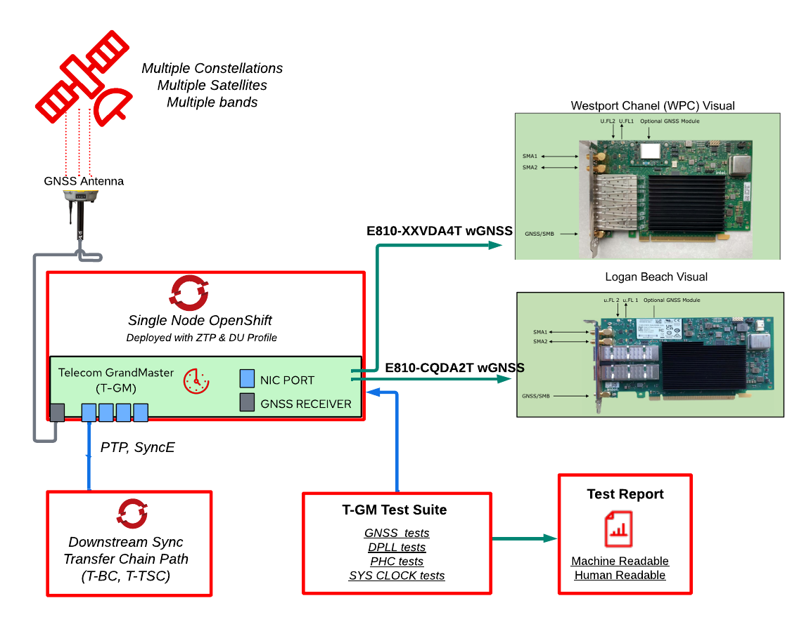

<figcaption class="figure-caption text-center">

**Figure 1**  A representation of a system under test with the required HW capabilities to run the test suite.

</figcaption>

It is important to highlight the need of:

* A fresh installation of Single Node OpenShift Container Platform (SNO) with at least [release 4.14.6](https://docs.openshift.com/container-platform/4.14/release_notes/ocp-4-14-release-notes.html) and the [PTP operator](https://catalog.redhat.com/software/containers/openshift4/ose-ptp-operator-bundle/5f5ba412bed8bd77416201e7) installed.

* A Red Hat certified Intel timing card capable of acting as a T-GM. One is the [E810-XXVDA4T with GNSS](https://catalog.redhat.com/hardware/components/detail/236227) card (WestPort Channel). Another Intel T-GM candidate is the [E810-CQDA2T with GNSS](https://catalog.redhat.com/hardware/components/detail/236237) card (Logan Beach).

* A GNSS antenna with clear sight of the sky connected to the  [u-Blox ZED-F9T](https://www.u-blox.com/en/product/zed-f9t-module?legacy=Current#Documentation-&-resources) GNSS receiver of the Intel timing card capable of acting as T-GM clock (WestPort Channel or Logan Beach).

See below an example showing a summary of the environment validation indicating a `good` state. The results indicate that the performance T-GM tests are conducted in an environment considered valid for testing a T-GM. This means that the data and post-processing stages used to calculate the KPIs of interest to measure the performance of the T-GM are considered good and worth of further analisys.

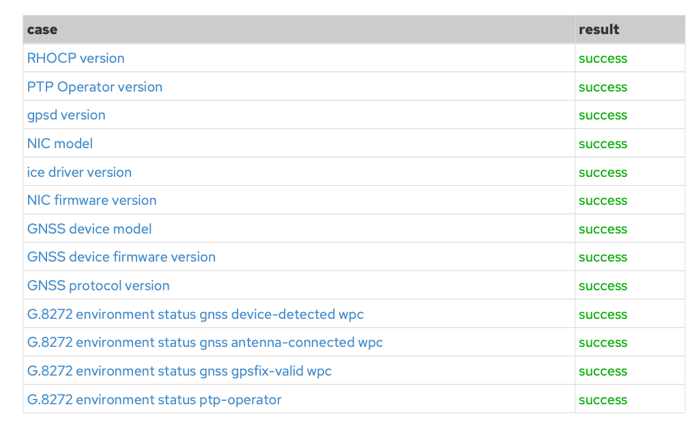

<figcaption class="figure-caption text-center">

**Figure 2**  The environment under test is compliant for pursuing the performance characterization.

</figcaption>

See below an example where the environment validation test case `ice driver version` reports an `error`. In this case the error refers to a version mismatch with the device driver version used. Remember that device drivers are required to activate special HW as it is the case of the certified Intel physical cards capables of acting as a T-GM: [E810-XXVDA4T](https://catalog.redhat.com/hardware/components/detail/236227) and [E810-CQDA2T](https://catalog.redhat.com/hardware/components/detail/236237).

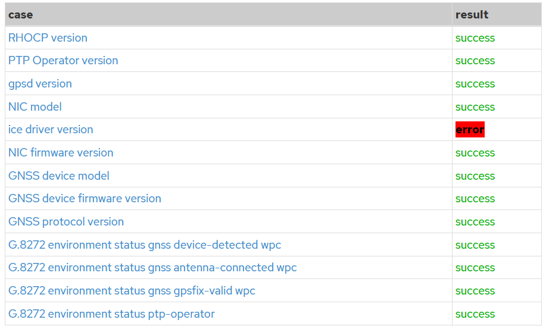

<figcaption class="figure-caption text-center">

**Figure 3** Environment Validation: The case of the unsupported device driver (`ice driver version`).

</figcaption>

In particular, the T-GM test suite expects device driver version belonging to upstream (aka in-tree) and not out-of-tree. In-tree drivers are upstreamed into the linux kernel itself and Red Hat takes these upstreamed drivers and test them before they eventually make it to downstream product like RHEL or OpenShift. In this case, the test report indicates that the T-GM device has been activated with an out-of-tree driver, which is not included within the scope of tested drivers that Red Hat supports for their products like RHEL or OpenShift. This is an indication to the reader of the test report that the T-GM performance tests cannot be trusted since the environment under test does not include a full supported Red Hat OpenShift product.

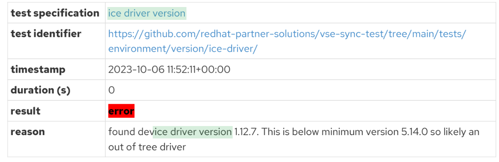

<figcaption class="figure-caption text-center">

**Figure 4** Environment Validation: Ice Driver Version.

</figcaption>

## Understanding T-GM Performance Tests 

### Why is this more complex than Pass/Fail?

This class of tests is more complex than determining `whether a WPC card has connected a GNSS antenna or not` as was the case for the environment validation tests. Doing the T-GM performance characterization implies answering questions such as, `what is distribution of the Time Error in the this clock?` For this reason, we include the T-GM test results in the form of graphs in the test report for different metrics so that the user can 1) interpret whether our T-GM solution is capable of meeting the requirements of their workloads, and 2) improve the efficiency of RCA practices by accelerating problem detection within the T-GM synchronization chain. Some additional considerations follow:

* Different Performance Classes determining the end-to-end budget: [ITU G.8272](https://www.itu.int/rec/T-REC-G.8272/en) refers to the recommendation for Primary Reference Time Clocks (PRTC). The document details the characteristics and timing requirements of a PRTC. All the T-GM tests integrated in the test report are defined in ITU-T G.8272. Please refer to the test specification of the test for a more detailed information. G.8272 Amendment 2 defines two types of PRTCs, PRTC-A and PRTC-B. The PRTC-B time accuracy requirements are more strict than that for PRTC-A devices. The type of PRTC determines the limits for each of the metrics that are measured to evaluate the performance of the T-GM. 

* Measurement period: What duration of the measurement is considered valid to have an statistically representative data set is something for the user to configure and will depend on the use case or the specific clock performance metric. In the same way, the calculation of the transient period is also set up by the user to determine locked operation conditions.

* Multiple links in the T-GM synchronization chain: The performance of a T-GM depends on the combined effect of the different links composing the timing chain. Basically it is the aggregated performance of all the clocks in the synchronization path inside the T-GM. The tests in our [test reports](addmat/test_report_fiesta_20231103T110635Z_84adb821.pdf) reveal the performance of the different clocks in the T-GM synchronization path. Note that we provide an educated guess of whether that measurement is considered independently a Pass or a Fail without prior knowledge of the performance of other clock in the T-GM synchronization chain. *For this reason, we recommend to ALWAYS review all the data represented in the graphs to understand if for instance a Fail (or even a Pass) to get a global view of the whole T-GM synchronization chain*.

In what follows, we provide an overview of each of the metrics under test: [Time Error](#understanding-time-error), [Maximum Time Interval Error](#understanding-maximum-time-interval-error), [Time Deviation](#understanding-time-deviation), and [PTP HW clockClass](#understanding-ptp-hw-clockClass).

### Understanding Time Error 

Time Error (TE) quantifies the difference between two clocks: a clock under measurement and a reference clock. The measurement represents the relative difference between two time signals. Even when the clock under measurement is considered to be synchronized to the reference clock, there are always errors that can be observed in the final synchronized clock signal.

Let's explain the TE metric with an example. First an example where TE is well above ITU-T recommendations for both PRTC-A and PRTC-B. Looking at the graph we can provide the following observations:

- The measured TE could vary over time. Because of this reason it is important to note that TE is measured over a sufficiently long time period. A minimum duration of `1000s` under normal, locked operating conditions is recommended by [ITU G.8272](https://www.itu.int/rec/T-REC-G.8272/en). And this is one of the reasons why we let the user specify the duration of the measurement.

- The measured TE can be negative or positive. A negative Time Error (TE) occurs when the measured clock signal under test arrives later than the reference clock signal. A positive Time Error (TE) occurs when the measured clock signal under test leads the reference clock signal.

- A very relevant value is the maximum absolute Time Error, which can be denoted as max|TE|. The max|TE| is a single value, representing the TE value that lies further away from the reference clock. In this case max|TE| reaches more than `1s`, which is clearly outside the limits allowed by PRTC-A and PRTC-B classes.

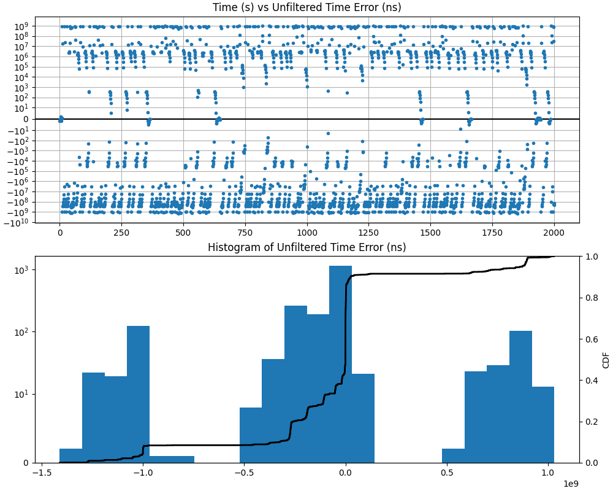

<figcaption class="figure-caption text-center">

**Figure 5** Time Error T-GM KPI results above any PRTC mask. This indicates the TE is experiencing high fluctuations revealing very low accuracy.

</figcaption>

Now let's illustrate a case where the T-GM is reporting TE result within ITU-T recommendations. See below the TE distribution over a duration of `54000s`. We can provide the following observations for the very same aspects commented in the Figure above:

- Again the measured TE could vary over time. Because of this reason it is important to note that TE is measured over a sufficiently long time period. A minimum duration of 1000s under normal, locked operating conditions is recommended by [ITU G.8272](https://www.itu.int/rec/T-REC-G.8272/en). And this is one of the reasons why we let the user specify the duration of the measurement.

- Again the measured TE can be negative or positive. A negative Time Error (TE) occurs when the measured clock signal under test arrives later than the reference clock signal. A positive Time Error (TE) occurs when the measured clock signal under test leads the reference clock signal.

- The max|TE| in this case max|TE| reaches `2ns`, which is clearly inside the limits allowed by PRTC-A and PRTC-B classes.

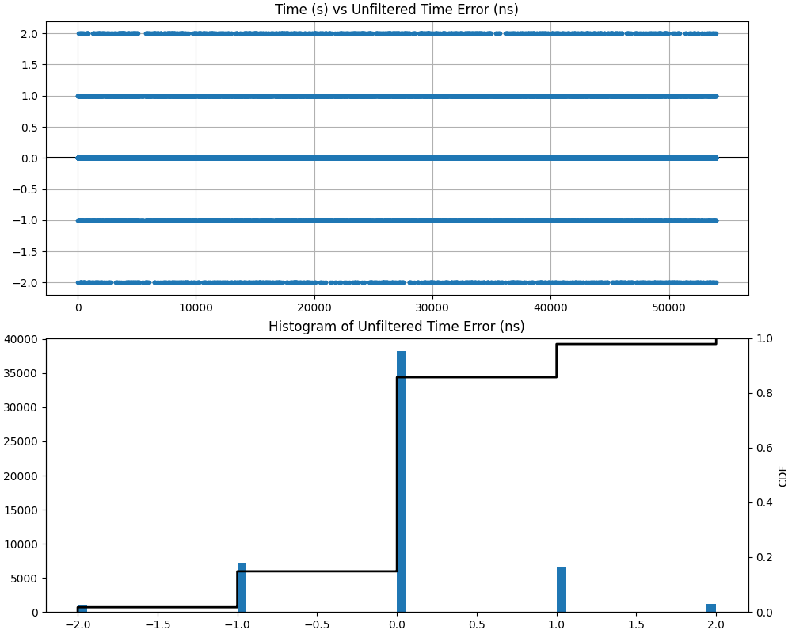

<figcaption class="figure-caption text-center">

**Figure 6** Time Error T-GM KPI results below PRTC-A (`100ns`) and PRTC-B (`40ns`) limits.

</figcaption>

### Understanding Maximum Time Interval Error

First, let's define the time interval error (TIE). The TIE is the measure of the change in the TE over an observation interval, also referred to as τ(tau). Note that the TE itself is the phase error of the measured clock as compared to the reference clock. The change observed in the TE, or the TIE, is the difference between the observed TE values over an specific τ observation interval.

The τ observation interval is a time interval that is generally fixed before the start of a measurement test. The TE is measured and recorded at the beginning of the test and after each observation interval time has passed; and the difference between the corresponding time error values gives the TIE for that observation interval.

TIE measures the total error that a clock has accumulated as compared to a reference clock since the beginning of the test. Also, because TIE is calculated from TE, TIE is also measured using units of seconds. By convention the value of TIE is defined to be zero at the start of the measurement. If you observe a MTIE of zeros means that the TIE has not changed at all during the observation interval τ.

This maximum variation of the TIE within an observation interval is known as the Maximum Time Interval Error (MTIE). The MTIE is defined in ITU-T G.810 as “the maximum peak-to-peak delay variation of a given timing signal” for a given
observation interval. As this essentially represents the variation in the clock, it is also referred to as the maximum peak-to-peak clock variation. The MTIE is focused on showing outliers w.r.t to TIE. A few observations follow:

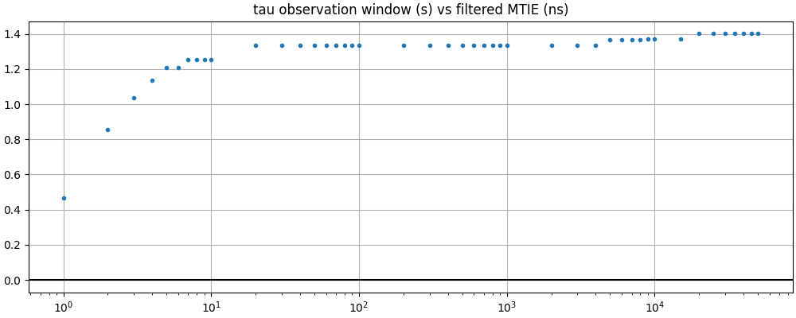

<figcaption class="figure-caption text-center">

**Figure 7** Good Maximum Time Interval Error Results passing PRTC-A and PRTC-B masks.

</figcaption>

- MTIE quantifies the maximum TIE over a particular time interval is used in the telecom industry. *This makes MTIE very sensitive to a single extreme positivie or negative TE values. Thus, MTIE shows the largest phase swings, making it sort of a peak detector for the various τ observation window intervals*.

- The measured MTIE can only increase over time. Because of this reason it is important to note that MTIE is measured over a sufficiently long time period. MTIE calls for the maximum observation interval.

- The measured MTIE can be only positive. Note that the minimum test window period for TDEV is twelve times the maximum observation interval in accordance with ITU-T recommendation [G.811](https://www.itu.int/rec/T-REC-G.811-199709-I/en[G.811]).

So are the reported MTIE values in the Figure above bad or good? It always depends on the MTIE masks (or MTIE limits)! In our case the maximum observed MTIE ocurring at low observation intervals is 1ns which is well below the MTIE limits during the whole observation intervals of above 10ns. This reveals that the reported MTIE measurements showed in the Figure above (for the observed window interval) is able to comply with both PRTC-A and PRTC-B requirements.

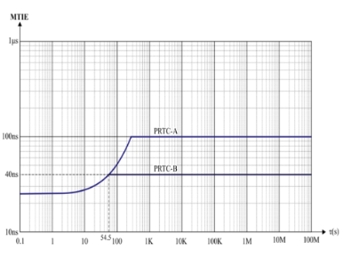

<figcaption class="figure-caption text-center">

**Figure 8** Maximum Time Interval Error Limits for PRTC-A and PRTC-B.

</figcaption>

### Understanding Time Deviation

Time Deviation (TDEV) is similar to MTIE, but rather than specifying the maximum peak-to-peak time error over an observation interval τ, TDEV is metric to quantify the degree of phase variation present in the clock signal based on TIE measurements.
According to ITU-T G.810, TDEV can be defined as `a measure of the expected time variation of a signal as a function of integration time.` So, TDEV is particularly useful in revealing the presence of several noise processes in clocks over a given time interval; and this calculated measurement is compared to the limit (specified as a mask in the recommendations) for each clock type.

- The measured TDEV can be only possitive, it cannot be negative.
 
- The measured TDEV could vary over time. Because of this reason it is important to note that TDEV is measured over a sufficiently long time period. The duration interval for running TDEV tests calls for 12 times the maximum observation interval to get accurate TDEV results in accordance to ITU-T recommendation [G.811](https://www.itu.int/rec/T-REC-G.811-199709-I/en)

- *TDEV focuses on measuring how stable is the expected phase offset (also referred here to as TE). TDEV takes out largest unfrequent phase swings that the MTIE metric already captures. If we dont see a decreasing TDEV values, the clock under test is not really stable phase-wise.*

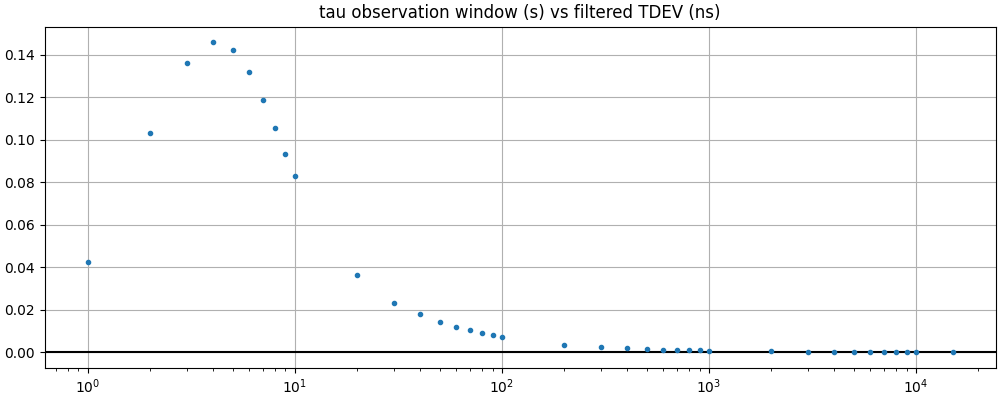

<figcaption class="figure-caption text-center">

**Figure 9** Time Deviation Results passing PRTC-A and PRTC-B masks.

</figcaption>

So is this reported TDEV graph bad or good? It depends on the TDEV masks (or TDEV limits)! In our case the maximum observed TDEV ocurring at low observation intervals is around `0.14ns` which is below the `1ns` for PRTC-B and `5ns` for PRTC-A of TDEV limit during the whole observation intervals. This reveals that out TDEV measurement showed in the Figure above (for the observed window interval) is able to comply with both PRTC-A and PRTC-B.

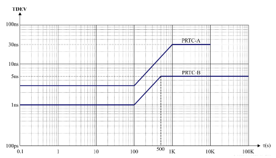
<figcaption class="figure-caption text-center">

**Figure 10** Time Deviation Limits for PRTC-A and PRTC-B.

</figcaption>

### Understanding PTP HW clockClass

The last section is related to the measurement of PTP `clockClass` announced states communicated to downstream devices by means of the PTP protocol. This test provides a mechanism to evaluate the state of the PTP HW Clock under test. This test gives an idea of whether the PTP `clockClass` state transitions are valid according to the PTP specifications. For this purpose we use heatmaps as representation tool. In our case note that:

- Heatmaps can be used to explain the relationship between two variables, one variable plotted on each axis. We use heatmaps to represent the PTP `clockClass` announced state between two consecutive measurement instants. Some observations regarding the heatmap, which is detailed in the Figure below: 

- Cell colorings represent an affordable PTP `clockClass` state transition being blue to yellow a `good` transition, and red a `bad` transition. A `good` transition is that showed in the Figure below, i.e., going from LOCKED to LOCKED during two consecutive measurement points. A `bad` transition example is for instance to go FROM FREERUN to HOLDOVER.

- The numeric positive value in each cell counts the frequency that PTP `clockClass` state transition happens. An example of good transition is going from LOCKED `clockClass` to LOCKED `clockClass`.

In the example below we are illustrating a case where the PTP Hardware `clockClass` state transition to the same state during the whole duration of the capture. The announced PTP `clockClass` is in LOCKED state during the whole duration of the data capture. This means that the PTP clock is traceable to PRTC in LOCKED mode. Thus, all the devices that are connected to it are receiving a valid `clockClass` valid to get in sync. Note the ranges or values expected with regards to the `clockClass`:

- FREERUN=248

- LOCKED=6

- HOLDOVER_IN_SPEC=7

- HOLDOVER_OUT_OF_SPEC=(140,150,160)

Any other clock class value will immediately report a test FAILURE.

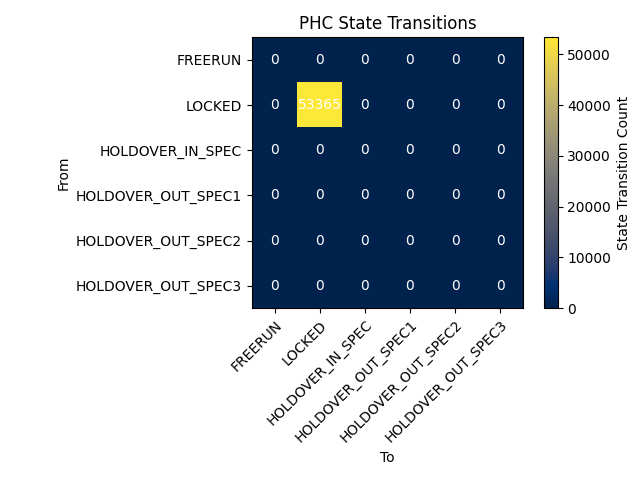
<figcaption class="figure-caption text-center">

**Figure 11** PTP HW Clock Announced Classes.

</figcaption>

This test also validates whether the phase/time traceability information acommpanying the state are compliant with the PTP clock class state announced. Thus, it is worth nothing that the test can fail even if the heatmap show a PTP compliant heatmap with respect to clock state transitions. An attribute worth mentioning is `clockAccuracy`, which for the test to not fail is as follows:

* `0x21` when `clockClass` is LOCKED. For a T-GM connected to a PRTC in locked-mode ,i.e., PRTC traceable to GNSS or a T-GM connected to an ePRTC where the ePRTC is in phase/time holdover within ITU-T [G.8272.1](https://www.itu.int/rec/T-REC-G.8272/en) ePRTC-A specification as specified in Table 3 of ITU-T [G.8272.1](https://www.itu.int/rec/T-REC-G.8272/en).

* `0xFE` when `clockClass` is FREERUN or HOLDOVER_IN_SPEC or HOLDOVER_OUT_OF_SPEC. For a T-GM not connected to an ePRTC nor a PRTC in locked-mode, or a T-GM connected to an ePRTC in phase/time holdover but outside the holdover specification in Table 3 of ITU-T G.8272.1.

As for the clock attribute `offsetScaledLogVariance` to not make the test fail:

* `0x4E5D` when `clockClass` is LOCKED for a T-GM connected to a PRTC in locked-mode (i.e., PRTC traceable to GNSS).

* `0xFFFF` when `clockClass` is FREERUN or HOLDOVER_IN_SPEC or HOLDOVER_OUT_OF_SPEC. For a T-GM not connected to an ePRTC in locked-mode nor to a PRTC in locked mode.
